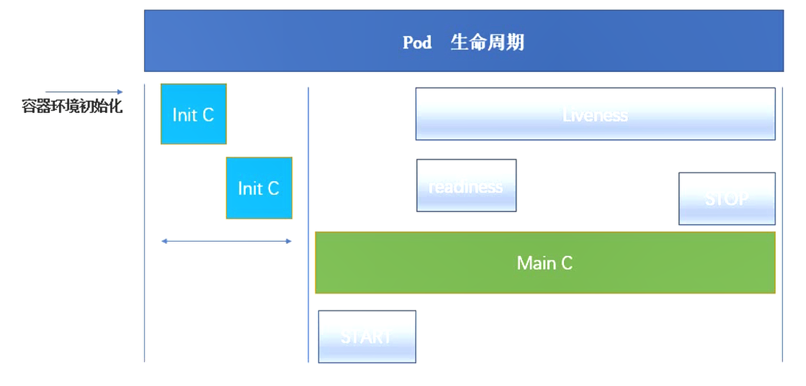

容器化应用的自动部署、扩缩和管理

### kubernetes组件理解

问题：kubernetes包含几个组件。各个组件的功能是什么。组件之间是如何交互的。

这个问题从两个角度回答，一是从官方介绍中，二是从部署中。

官方文档参照 https://kubernetes.io/docs/concepts/overview/components/ 。

大致分为3个部分：Master节点、Node节点、应用。

Master节点提供集群的控制面板，其下组件有：

- kube-apiserver 提供k8s的API调用服务。
- etcd 数据中心，存储集群的所有数据。
- kube-scheduler 调度器，负责给新创建的容器分配节点等。
- kube-controller-manager 控制管理器，负责监控和维护集群状态。

其中controller又包含：

- Node Controller 报告节点健康状态。
- Replication Controller 维护rc的pod个数，pod挂掉又控制重启。
- Endpoints Controller 填充Endpoint对象，主要是给Service和Pod。
- Service Account & Token Controllers 创建帐号和Token。

Master节点还包含：

- cloud-controller-manager 是提供给第三方开发k8s特性的。

Node节点组件：

- kubelet 管理Pod里面的容器。
- kube-proxy 管理网络路由规则。
- container runtime 容器运行环境，如Docker等。

应用：

应用都是部署在kube-system这个命名空间下的。如：

- DNS dns服务。
- Dashboard web管理界面。
- Container Resource Monitoring 容器资源管理和监控，如cAdvisor、Prometheus。
- Cluster-level Logging 日志收集分节点、集群、应用三种类型，可用elk或fluentd等。

另外，从部署上来看，这里参见的是 https://github.com/gjmzj/kubeasz 这个项目， 这个项目使用ansible部署k8s集群，步骤如下：

1. 分发CA证书到各机器
2. 部署etcd集群
3. 部署docker服务
4. 在Master节点部署kube-apiserver、kube-controller-manager、kube-scheduler
5. 在Node节点部署kubelet、kube-proxy和cni插件(bridge、host-local、loopback)
6. 部署kubedns、dashborad、heapster等。

### k8s的pause容器作用

问题：k8s的pause容器有什么用。是否可以去掉。

我们看下在node节点上都会起很多pause容器，和pod是一一对应的。

每个Pod里运行着一个特殊的被称之为Pause的容器，其他容器则为业务容器，这些业务容器共享Pause容器的网络栈和Volume挂载卷，因此他们之间通信和数据交换更为高效，在设计时我们可以充分利用这一特性将一组密切相关的服务进程放入同一个Pod中。同一个Pod里的容器之间仅需通过localhost就能互相通信。

**kubernetes中的pause容器主要为每个业务容器提供以下功能：**

PID命名空间：Pod中的不同应用程序可以看到其他应用程序的进程ID。

网络命名空间：Pod中的多个容器能够访问同一个IP和端口范围。

IPC命名空间：Pod中的多个容器能够使用SystemV IPC或POSIX消息队列进行通信。

UTS命名空间：Pod中的多个容器共享一个主机名；Volumes（共享存储卷）：

Pod中的各个容器可以访问在Pod级别定义的Volumes。

### k8s的pod内容器之间的关系

问题：k8s中的pod内几个容器之间的关系是什么。

我们看k8s官方文档的解释：

一个Pod是一组容器的集合，像豌豆荚于豌豆。提供容器间存储和网络的共享，和一系列运行规范。

原文：https://kubernetes.io/docs/concepts/workloads/pods/pod/

Pod里面的容器共享网络，因此可使用localhost通讯。由于也共享存储，所以可以使用IPC和共享内存进行通讯。

### 经典pod的生命周期

问题：一个经典pod的完整生命周期。

同样参见官方文档：https://kubernetes.io/docs/concepts/workloads/pods/pod-lifecycle/

Pod都处于以下几种状态之一，可通过查询Pod详情查看。

- Pending 部署Pod事务已被集群受理，但当前容器镜像还未下载完。
- Running 所有容器已被创建，并被部署到k8s节点。
- Successed Pod成功退出，并不会被重启。
- Failed Pod中有容器被终止。
- Unknown 未知原因，如kube-apiserver无法与Pod进行通讯。

详细叙述如下：

首先拖取Pod内容器的镜像，选择某个Node节点并启动Pod。 监控Pod状态，若Pod终止则根据策略决定是否重新调度。 Pod退出，并根据策略决定是否重启。

### service和ep如何关联和影响

问题：k8s的service和ep是如何关联和相互影响的。

ephemeral storage 是k8s 1.8引入的特性，用作限制临时存储，可为Pod的每个容器单独配置。

它包括四个方面：EmptyDie volumes、Container logs、image layers和container writable layers。

注：容器可写层即向容器内写入文件时占用的存储。

当任意一个容器超过限制，或整个Pod超过限制，则Pod将被放逐(如果Pod有重启策略，则在另外Node复活)。

因为该特性是Pod中Container级别的，而service给pod暴露服务。所以，当Pod被放逐，service会受到部分影响。

### 详述kube-proxy原理

问题：详述kube-proxy原理，一个请求是如何经过层层转发落到某个pod上的整个过程。请求可能来自pod也可能来自外部。

kube-proxy部署在每个Node节点上，通过监听集群状态变更，并对本机iptables做修改，从而实现网络路由。 而其中的负载均衡，也是通过iptables的特性实现的。

另外我们需要了解k8s中的网络配置类型，有如下几种：

- hostNetwork Pod使用宿主机上的网络，此时可能端口冲突。
- hostPort 宿主机上的端口与Pod的目标端口映射。
- NodePort 通过Service访问Pod，并给Service分配一个ClusterIP。

### rc/rs实现原理

问题：rc/rs功能是怎么实现的。详述从API接收到一个创建rc/rs的请求，到最终在节点上创建pod的全过程，尽可能详细。另外，当一个pod失效时，kubernetes是如何发现并重启另一个pod的？

Replication Controller 可以保证Pod始终处于规定的副本数。

而当前推荐的做法是使用Deployment+ReplicaSet。

ReplicaSet 号称下一代的 Replication Controller，当前唯一区别是RS支持set-based selector。

RC是通过ReplicationManager监控RC和RC内Pod的状态，从而增删Pod，以实现维持特定副本数的功能。

可参见：https://blog.csdn.net/WaltonWang/article/details/62433143

RS也是大致相同。

### deployment/rs区别

问题：deployment/rs有什么区别。其使用方式、使用条件和原理是什么。

deployment是rs的超集，提供更多的部署功能，如：回滚、暂停和重启、 版本记录、事件和状态查看、滚动升级和替换升级。

如果能使用deployment，则不应再使用rc和rs。

### 设计千台物理机的k8s集群

问题：设想一个一千台物理机，上万规模的容器的kubernetes集群，请详述使用kubernetes时需要注意哪些问题？应该怎样解决？（提示可以从高可用，高性能等方向，覆盖到从镜像中心到kubernetes各个组件等）

### 一千到五千台的瓶颈

问题：设想kubernetes集群管理从一千台节点到五千台节点，可能会遇到什么样的瓶颈。应该如何解决。

### 集群运营注意要点

问题：kubernetes的运营中有哪些注意的要点。

### 产生雪崩和预防

问题：集群发生雪崩的条件，以及预防手段。

### 设计代替kube-proxy的实现

问题：设计一种可以替代kube-proxy的实现

### sidecar在k8s中应用

问题：sidecar的设计模式如何在k8s中进行应用。有什么意义。

### 灰色发布在原生k8s中的实现

问题：灰度发布是什么。如何使用k8s现有的资源实现灰度发布。

### 介绍k8s实践中踩的大坑

问题：介绍k8s实践中踩过的比较大的一个坑和解决方式。