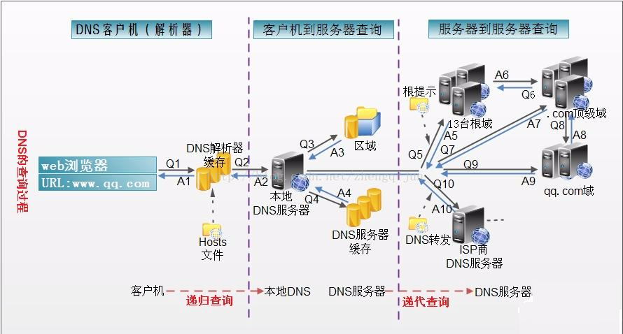

## DNS服务

### DNS服务的工作过程

1. 在浏览器中输入`www.qq.com` 域名，当我们开始在浏览器中输入网址的时候，浏览器其实就已经在智能的匹配可能得 url 了，他会从历史记录，书签等地方，找到已经输入的字符串可能对应的 url，然后给出智能提示，让你可以补全url地址。对于 google的chrome 的浏览器，他甚至会直接从缓存中把网页展示出来，就是说，你还没有按下 enter，页面就出来了。
2. 如果浏览器没有，操作系统会先检查自己本地的hosts文件是否有这个网址映射关系，如果有，就先调用这个IP地址映射，完成域名解析。
3. 如果hosts里没有这个域名的映射，则查找本地DNS解析器缓存，是否有这个网址映射关系，如果有，直接返回，完成域名解析。
4. 如果hosts与本地DNS解析器缓存都没有相应的网址映射关系，首先会找TCP/IP参数中设置的首选DNS服务器，在此我们叫它本地DNS服务器，此服务器收到查询时，如果要查询的域名，包含在本地配置区域资源中，则返回解析结果给客户机，完成域名解析，此解析具有权威性。
5. 如果本地DNS服务器本地区域文件与缓存解析都失效，则根据本地DNS服务器的设置（是否设置转发器）进行查询，如果未用转发模式，本地DNS就把请求发至13台根DNS，根DNS服务器收到请求后会判断这个域名(.com)是谁来授权管理，并会返回一个负责该顶级域名服务器的一个IP。本地DNS服务器收到IP信息后，将会联系负责.com域的这台服务器。这台负责.com域的服务器收到请求后，如果自己无法解析，它就会找一个管理.com域的下一级DNS服务器地址`http://qq.com`给本地DNS服务器。当本地DNS服务器收到这个地址后，就会找`http://qq.com`域服务器，重复上面的动作，进行查询，直至找到`www.qq.com`主机。
6. 最终本地DNS将查询到的对应域名的解析记录发送给客户端，并在本地记录一份

> 只有 13 台 DNS 根域名服务器原因：[https://jaminzhang.github.io/dns/The-Reason-of-There-Is-Only-13-DNS-Root-Servers/](https://jaminzhang.github.io/dns/The-Reason-of-There-Is-Only-13-DNS-Root-Servers/)

1. 如果用的是转发模式，此DNS服务器就会把请求转发至上一级DNS服务器，由上一级服务器进行解析，上一级服务器如果不能解析，或找根DNS或把转请求转至上上级，以此循环。不管是本地DNS服务器用是是转发，还是根提示，最后都是把结果返回给本地DNS服务器，由此DNS服务器再返回给客户机。
2. 从客户端到本地DNS服务器是属于递归查询，而DNS服务器之间就是的交互查询就是迭代查询

