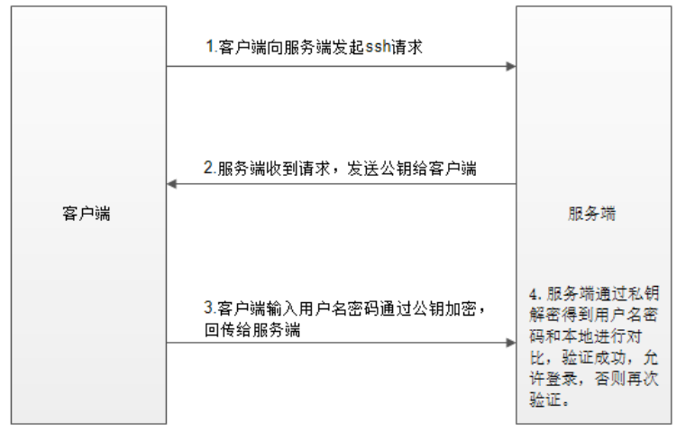
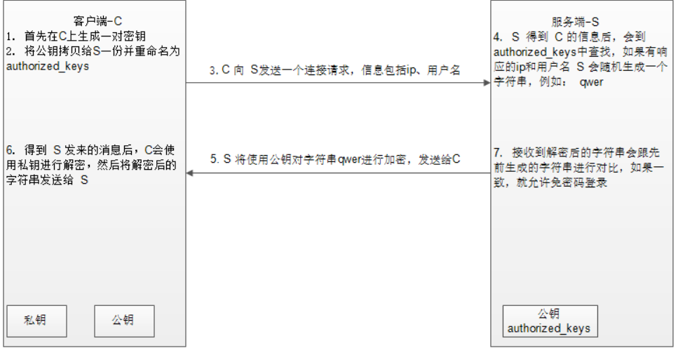

## ssh的登录验证方式-口令登录



## ssh的登录验证方式-密钥登录



## ssh的登录端口设置

```yaml
配置文件：/etc/ssh/sshd_config

Port 22                  #ssh服务默认监听端口

ListenAddress 0.0.0.0    #ssh服务默认监听IP地址
```


## ssh的登录用户设置

```bash
配置文件：/etc/ssh/sshd_config

PermitRootLogin yes        #是否允许root用户使用ssh登录
```

## ssh的登录超时设置

```bash
配置文件：/etc/profile

export TMOUT=300           #设置客户端5分钟无操作自动断开连接
```

## ssh尝试登录次数

```bash
配置文件：/etc/ssh/sshd_config         
MaxAuthTries 6             #置客户端登录失败尝试次数为6次
```

## 参考答案

1. 登录验证模式修改为密钥登录
2. 登录端口修改为非22端口以及指定监听IP
3. 禁止root用户远程登录
4. 设置无操作时自动断开连接设置
5. 登录失败后登录尝试次数为6次
6. 编写防火墙规则，使用白名单机制放行ssh服务的监听端口