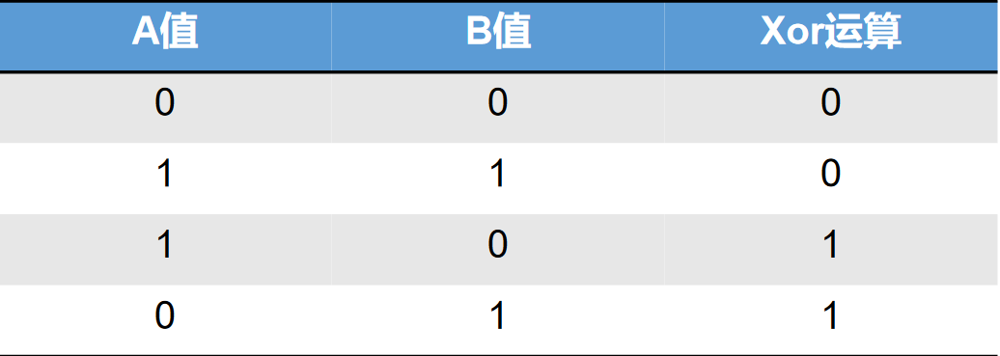

## Raid

### Raid 0（独立磁盘冗余阵列）

- 必须使用两块或两块以上硬盘组成
- 每块硬盘的大小必须一致
- 是所有动态磁盘中，数据读写最快的
- 损坏几率相对最高
- 没有磁盘容错功能

### Raid 1 

- 由两块或2的倍数硬盘组成
- 每块硬盘大小必须一致
- 硬盘使用率只有50%，写入速度最慢
- 拥有磁盘容错功能

### Raid 5 

- 由三块或三块以上硬盘组成

- 每块硬盘大小必须一致

- 磁盘利用率是n-1块盘

- 利用奇偶校验，拥有磁盘容错功能（只支持1块硬盘损坏）

### Raid 5的奇偶校验（异或校验）

### Raid 6

- Raid 6是Raid 5的增强版
- 由4块或以上硬盘组成
- 每块硬盘大小必须一致
- 磁盘利用率是n-2块盘
- 支持磁盘容错，可以支持2块硬盘损坏

Raid 10 

- 必须有4块等大小的硬盘组成
- 两两硬盘先组成Raid 1 ，再组成Raid 0 
- 兼顾Raid 0和Raid 1的特点，中和两种Raid的缺点

### 软Raid与硬Raid的区别

- 软Raid：是由操作系统模拟的的Raid，一旦硬盘损坏，操作系统就会损坏，Raid会丧失作用。
- 硬Raid：是由独立于硬盘之外的，硬件Raid卡组成；就算硬盘损坏，也不会导致Raid卡损坏，磁盘容错才能起作用