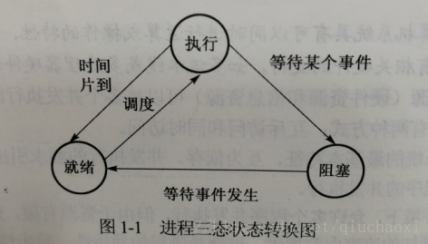

### 进程和线程的区别

进程是资源分配的最小单位，线程是 CPU 调度的最小单位。

- 进程只是维护应用程序所需的各种资源，而线程则是真正的执行实体。
- 进程中除了包含线程之外，还包含有独立的内存体，堆区，BSS 段，数据段，代码段等。
- 不同进程间数据资源很难共享，而多个线程可以很方便地共享进程资源。
- 进程要比线程消耗更多的计算机资源。
- 进程间不会相互影响，一个线程挂掉可能会导致进程挂掉，从而引发其他线程挂掉。

程序: 通常是二进制程序 放置在存储媒介中 为物理文件的形式存在

进程: 程序被触发后 执行者的权限和属性, 程序的代码和所需数据等都会被加载到内存中, 操作系统给予这个内存中的单元一个标识符PID 可以说 进程就是一个正在运行的程序

**进程**是资源（CPU、内存等）分配的基本单位，它是程序执行时的一个实例。程序运行时系统就会创建一个进程，并为它分配资源，然后把该进程放入进程就绪队列，进程调度器选中它的时候就会为它分配CPU时间，程序开始真正运行。

**线程**是程序执行时的最小单位，它是进程的一个执行流，是CPU调度和分派的基本单位，一个进程可以由很多个线程组成，线程间共享进程的所有资源，每个线程有自己的堆栈和局部变量。线程由CPU独立调度执行，在多CPU环境下就允许多个线程同时运行。同样多线程也可以实现并发操作，每个请求分配一个线程来处理。   

> ​     进程和程序的区别    

   进程是动态的，而程序是静态的。    

   进程有一定的生命期，而程序是指令的集合，本身无“运动”的含义。没有建立进程的程序不能作为1个独立单位得到操作系统的认可。    

​    1个程序可以对应多个进程，但1个进程只能对应1个程序。进程和程序的关系犹如演出和剧本的关系。   

 **一个进程可以创建多少个线程？和什么有关？**
 一个进程可以创建的线程数由可用虚拟空间和线程的栈的大小共同决定

## 进程的几种状态

1)       运行状态：进程正在处理器上上运行。在单处理器环境下，每个时刻最多只有一个进程处于运行状态。

2)       就绪状态：进程已处于准备运行状态，即进程获得了除了处理器之外的一切所需资源，一旦得到处理器即可运行。

3)       阻塞状态：又称为等待状态，进程正在等待某一事件而暂停运行，如等待某资源为可用（不包括处理器）或等待输入/输出完成。即使处理器空闲，该进程也不能运行。

4)       创建状态：进程正在被创建，尚未到就绪状态。

5)       结束状态：进程正在从系统中消失。可能是进程正常结束或其他原因中断退出运行。

  进程的3个基本状态是可以相互装换的，如图1-1所示。当一个就绪进程获得处理器时，其状态由就绪变为执行。

  当一个运行进程被剥夺处理器时，如用完系统分给他的时间片、出现更高优先级别的其他进程，其状态由运行变为就绪。

  当一个进程因为某件事情受阻时，如所申请资源被占用、启动I/O传输未完成，其状态由执行变为阻塞。

  当所等待事件发生时，如得到申请资源，I/O传输完成，其状态由阻塞变为就绪。
