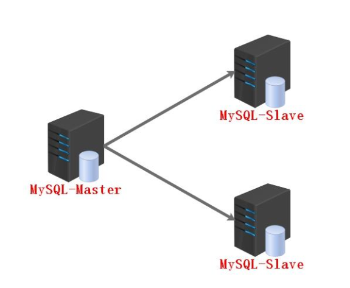
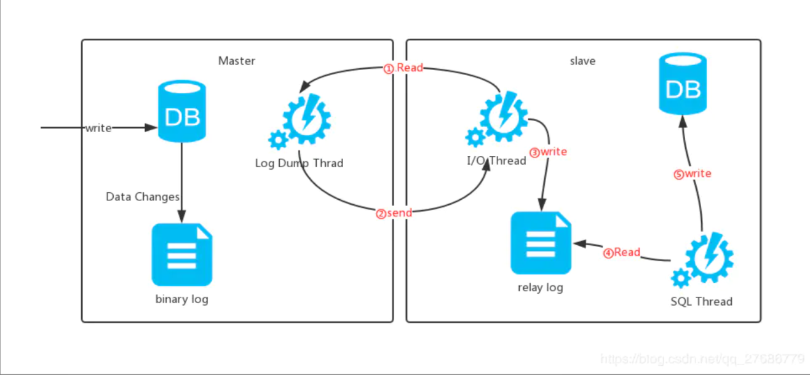
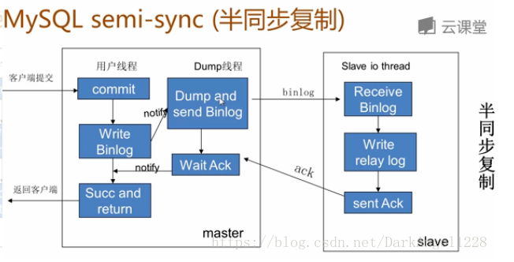

## Mysql集群相关

### 主从复制

主从复制，是用来建立一个和主数据库完全一样的数据库环境，称为从数据库；

主数据库一般是准实时的业务数据库

#### 主从复制的作用

1. 做数据的热备，作为后备数据库，主数据库服务器故障后，可切换到从数据库继续工作，避免数据丢失。
2. 架构的扩展。业务量越来越大，I/O访问频率过高，单机无法满足，此时做多库的存储，降低磁盘I/O访问的频率，提高单个机器的I/O性能。
3. 读写分离，使数据库能支撑更大的并发。在报表中尤其重要。由于部分报表sql语句非常的慢，导致锁表，影响前台服务。如果前台使用master，报表使用slave，那么报表sql将不会造成前台锁，保证了前台速度。
4. 备份，避免影响业务

#### 主从复制的原理

1.数据库有个bin-log二进制文件，记录了所有sql语句。

2.从数据库把主数据库的bin-log文件的sql语句复制过来。

3.让其在从数据的relay-log重做日志文件中再执行一次这些sql语句即可。

具体需要==三个线程==来操作：

1. binlog输出线程。每当有从库连接到主库的时候，主库都会创建一个线程然后发送binlog内容到从库。

在从库里，当复制开始的时候，从库就会创建两个线程进行处理：

2. 从库I/O线程。当`START SLAVE`语句在从库开始执行之后，从库创建一个 I/O Thread ，该线程连接到主库并请求主库发送binlog里面的更新记录到从库上。（如果该线程追赶上了主库，会进入睡眠状态）从库I/O线程读取主库的binlog输出线程发送的更新并拷贝这些更新到本地文件，其中包括relay log文件。

3. 从库的SQL线程。从库创建一个SQL线程，这个线程读取从库I/O线程写到relay log的更新事件并执行。

可以知道，对于每一个主从复制的连接，都有三个线程。

#### 具体过程

拥有多个从库的主库为每一个连接到主库的从库创建一个binlog输出线程，每一个从库都有它自己的I/O线程和SQL线程。

1. slave 服务器执行 start slave，开启主从复制开关，slave 服务器的 I/O Thread 请求从 master 服务器读取 binlog（如果该线程追赶上了主库，会进入睡眠状态）

2. master 服务器创建 Log Dump Thread，把 binlog 发送给 slave 服务器。slave 服务器的 I/O Thread 将读取到的 binlog 日志内容写入中继日志 relay log（中继日志，mysql-relay-bin.xxxxxx，会记录位置信息，以便下次继续读取）

3. slave 服务器的 SQL Thread 会实时监测 relay log 新增的日志内容，Exec_Master_Log_Pos位置开始执行读取到的更新事件，并解析成 SQL 语句，并执行，以此实现主从的操作一致，而最终数据一致；

### 主从复制存在的问题

在高并发场景下，从库的数据一定会比主库慢一些，是**有延时**的。所以经常出现，刚写入主库的数据可能是读不到的，要过几十毫秒，甚至几百毫秒才能读取到。

- 主库宕机后，数据可能丢失
- 从库只有一个sql Thread，主库写压力大，复制很可能延时

解决方法：

- 半同步复制—解决数据丢失的问题
- 并行复制—-解决从库复制延迟的问题

#### 半同步复制

**mysql semi-sync（半同步复制）**

半同步复制：

- 5.5集成到mysql，以插件的形式存在，需要单独安装
- 确保事务提交后binlog至少传输到一个从库
- 不保证从库应用完这个事务的binlog
- 性能有一定的降低，响应时间会更长
- 网络异常或从库宕机，卡主主库，直到超时或从库恢复

##### 半同步复制原理

5.5之前，MySQL的复制其实是异步操作，而不是同步

- 事务在主库写完binlog后需要从库返回一个已接受，才放回给客户端
- 5.5集成到mysql，以插件的形式存在，需要单独安装
- 确保事务提交后binlog至少传输到一个从库
- 不保证从库应用完成这个事务的binlog
- 性能有一定的降低
- 网络异常或从库宕机，卡主库，直到超时或从库恢复
  

#### 并行复制

mysql并行复制

- 社区版5.6中新增
- 并行是指从库多线程apply binlog库级别并行应用binlog，同一个库数据更改还是串行的(5.7版并行复制基于事务组)设置
- 设置sql线程数为10 `set global slave_parallel_workers=10;`
  

### 复制出错处理

常见：1062（主键冲突），1032（记录不存在）