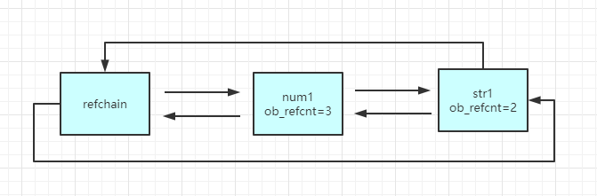
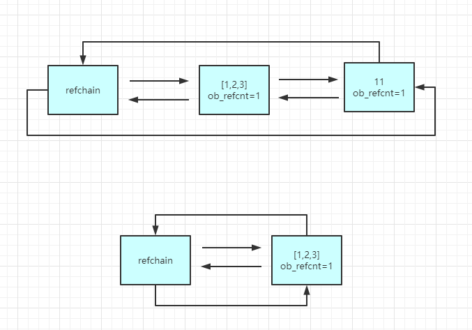

# Python垃圾回收

引用计数器为主，标记清除和分代回收为辅+缓存机制

## 1. 引用计数器

### 1.1  环状双向链表 refchain

在Python程序中创建的任何对象都会放在`refchain`中

`static PyObject refchain = {&refchain, &refchain}`


在Python程序中创建的任何对象都会放在`refchain`链表中

```python
str1 = "str"
num1 = 1
list1 = ["1","2"]
```

当进行上述操作时，Python内部会创建一些数据（上一个对象，下一个对象，类型，引用个数，元素个数）

`include/object.h`

```c
#define _PyObject_HEAD_EXTRA            \
    struct _object *_ob_next;           \
    struct _object *_ob_prev;
     
#define PyObject_HEAD       PyObject ob_base;
 
#define PyObject_VAR_HEAD      PyVarObject ob_base;
 
 
typedef struct _object {
    _PyObject_HEAD_EXTRA  // 用于构造双向链表
    Py_ssize_t ob_refcnt;  // 引用计数器
    struct _typeobject *ob_type;    // 数据类型
} PyObject;
 
 
typedef struct {
    PyObject ob_base;   // PyObject对象
    Py_ssize_t ob_size; /* Number of items in variable part，即：元素个数 */
} PyVarObject;
```

2个结构体

- **PyObject**，此结构体中包含3个元素。
  - _PyObject_HEAD_EXTRA，用于构造双向链表。
  - ob_refcnt，引用计数器。
  - ob_type，数据类型。
- **PyVarObject**，次结构体中包含4个元素（ob_base中包含3个元素）
  - ob_base，PyObject结构体对象，即：包含PyObject结构体中的三个元素。
  - ob_size，内部元素个数。

3个宏定义

- PyObject_HEAD，代指PyObject结构体。
- PyVarObject_HEAD，代指PyVarObject对象。
- _PyObject_HEAD_EXTRA，代指前后指针，用于构造双向队列。

Python中所有类型创建对象时，底层都是与PyObject和PyVarObject结构体实现，一般情况下由单个元素组成对象内部会使用PyObject结构体（float）、由多个元素组成的对象内部会使用PyVarObject结构体（str/int/list/dict/tuple/set/自定义类），因为由多个元素组成的话是需要为其维护一个 ob_size（内部元素个数）。

**PyObject：float**

**PyVarObject：list、dict、tuple、set、int、str、bool**

因为Python中的int是不限制长度的，所以底层实现是用的str，所以int也属于PyVarObject阵营。Python中的bool实际上是0和1，所以也是int，也属于PyVarObject阵营。


### 1.2  类型封装结构体

```c
// float类型
typedef struct {
    PyObject_HEAD
    double ob_fval;
} PyFloatObject;
```


```python
data = 1.11
内部会创建:
    _ob_netx = refchain的上一个对象
    _ob_prev = refchain的下一个对象
    ob_refcnt = 1 
    ob_type = float
    ob_fval = 1.11
```


### 1.3  引用计数器

```python
v1 = 1.11
v2 = 1
v3 = (1,2,3)
```

当python程序运行时，会根据数据类型的不同找到对应的结构体，根据结构体中的字段来进行创建相关的数据，然后将对象添加到refchain双线链表中。

每个对象中有`ob_refcnt`引用计数器，值默认为1，当有其他变量引用对象时，引用计数器就会发生变化。

```python
a = 1
b = a
```

```python
a = 1
b = a
del b # b变量删除: b对应的对象引用器-1
del a # a变量删除: a对用的对象引用其-1

# 当一个对象的引用计数器为0时,意味着没有人使用这个对象, 这个对象就是垃圾, 垃圾回收
# 回收: 
- 对象从refchain链表中移除
- 将对象销毁, 内存归还
```

```python
# 创建对象并初始化引用计数器为1
num1 = 1
num2 = num1 # 计数器+1
num3 = num1 # 计数器+1
num4 = num1 # 计数器+1

# 创建对象并初始化引用计数器为1
str1 = "str" # 计数器+1
str2 = str1  # 计数器+1
```




### 1.4  循环引用的问题

```python
list1 = [1,2,3] 
list2 = [1,2,3]
list1.append(list2) # 把v2追加到v1中, v2对应的引用计数器加1
list2.append(list1) # 把v1追加到v2中, v1对应的引用计数器加1
```

 list1与list2相互引用，如果不存在其他对象对它们的引用，list1与list2的引用计数也仍然为1，所占用的内存永远无法被回收，这将是致命的。

  对于如今的强大硬件，缺点1尚可接受，但是循环引用导致内存泄露，注定python还将引入新的回收机制。


## 2. 标记清除

目的：为了解决引用计数器循环引用的不足

实现：在Python的底层再维护一个链表，链表中专门放可能存在循环引用的对象（list/tuple/dict/set）



在Python内部`某种情况`触发, 会去扫描`可能存在循环应用的链表`中的每个元素, 检查是否有循环引用, 如果有则让双方的引用计数器-1; 如果是0则进行垃圾回收

问题：

- 什么时候扫描
- 可能存在循环引用的链表扫描代价大，每次扫描时间久

## 3.  分代回收

将可能存在循环应用的对象维护成3个链表：

- 0代：0代中对象的个数达到700个扫描一次
- 1代：0代扫描10次，则1代扫描一次
- 2代：1代扫描10次，则2代扫描一次

## 4.  小结

在Python中维护了一个`refchain`的双向环状链表, 这个链表中存储程序创建的所有对象, 每种类型的对象中都有一个`ob_refcnt`引用计数器的值, 引用个数+1, -1 , 最后当引用计数器变成0时会进行垃圾回收(对象销毁, 从refchain中移除)

但是. 在Python中对于那些可以有多个元素组成的对象可能会存在循环引用的问题, 为了解决这个问题Python引入了标记清除和分带回收, 在其内部维护了4个链表

- refchain
- 0代
- 1代
- 2代

在源码内部当达到各自的阈值时, 就会触发扫描链表进行标记清除的动作(有循环则各自-1)

# Python缓存

## 1.   池

为了避免重复创建和销毁一些常见对象, Python建立了维护池

```python
# 启动解释器时, python内部帮我们创建: -5,-4...257
v1 = 7 # 内部不会开辟内存, 直接去池中获取
v2 = 8 # 内部不会开辟内存, 直接去池中获取

```


## 2.  free_list

当一个对象的引用计数器为0时, 按理说应该回收, 但是内部不会直接回收,  而是将对象添加到`free_list`链表中当缓存。以后再去创建对象时，不再重新开辟内存，而是直接使用`free_list`

```python
v1 = 1.11 # 开辟内存, 内存存储结构体中定义那几个值, 并存到refchain中

del v1     # refchain中移除, 将对象添加到free_list中(80)个, free_list满了则销毁

v2 = 2.22  # 不会重新开辟内存, 去free_list中获取对象, 对象内部数据初始化, 再放到refchain中
```

- float类型，维护的free_list链表最多可缓存100个float对象。

  ```python
    v1 = 3.14    # 开辟内存来存储float对象，并将对象添加到refchain链表。  
    print( id(v1) ) # 内存地址：4436033488  
    del v1    # 引用计数器-1，如果为0则在rechain链表中移除，不销毁对象，而是将对象添加到float的free_list.  
    v2 = 9.999    # 优先去free_list中获取对象，并重置为9.999，如果free_list为空才重新开辟内存。  
    print( id(v2) ) # 内存地址：4436033488  
    # 注意：引用计数器为0时，会先判断free_list中缓存个数是否满了，未满则将对象缓存，已满则直接将对象销毁。
  ```

- int类型，不是基于free_list，而是维护一个small_ints链表保存常见数据（小数据池），小数据池范围：`-5 <= value < 257`。即：重复使用这个范围的整数时，不会重新开辟内存。

  ```python
  v1 = 38    # 去小数据池small_ints中获取38整数对象，将对象添加到refchain并让引用计数器+1。  
  print( id(v1))  #内存地址：4514343712  
  v2 = 38 # 去小数据池small_ints中获取38整数对象，将refchain中的对象的引用计数器+1。  
  print( id(v2) ) #内存地址：4514343712  
  # 注意：在解释器启动时候-5~256就已经被加入到small_ints链表中且引用计数器初始化为1，代码中使用的值时直接去small_ints中拿来用并将引用计数器+1即可。另外，small_ints中的数据引用计数器永远不会为0（初始化时就设置为1了），所以也不会被销毁。
  ```

- str类型，维护`unicode_latin1[256]`链表，内部将所有的`ascii字符`缓存起来，以后使用时就不再反复创建。

  ```python
  v1 = "A"  
  print( id(v1) ) # 输出：4517720496  
  del v1  v2 = "A"  
  print( id(v1) ) # 输出：4517720496  # 除此之外，Python内部还对字符串做了驻留机制，针对那么只含有字母、数字、下划线的字符串（见源码Objects/codeobject.c），如果内存中已存在则不会重新在创建而是使用原来的地址里（不会像free_list那样一直在内存存活，只有内存中有才能被重复利用）。  
  v1 = "wupeiqi"  
  v2 = "wupeiqi"  
  print(id(v1) == id(v2)) # 输出：True
  ```

- list类型，维护的free_list数组最多可缓存80个list对象。

  ```python
      v1 = [11,22,33]  
      print( id(v1) ) # 输出：4517628816  
      del v1  v2 = ["武","沛齐"]  
      print( id(v2) ) # 输出：4517628816
  ```

- tuple类型，维护一个free_list数组且数组容量20，数组中元素可以是链表且每个链表最多可以容纳2000个元组对象。元组的free_list数组在存储数据时，是按照元组可以容纳的个数为索引找到free_list数组中对应的链表，并添加到链表中。

  ```python
  v1 = (1,2)  
  print( id(v1) )  
  del v1  # 因元组的数量为2，所以会把这个对象缓存到free_list[2]的链表中。  
  v2 = ("武沛齐","Alex")  # 不会重新开辟内存，而是去free_list[2]对应的链表中拿到一个对象来使用。  
  print( id(v2) )
  ```

- dict类型，维护的free_list数组最多可缓存80个dict对象。

  ```python
    v1 = {"k1":123}  
      print( id(v1) )  # 输出：4515998128  
      del v1  v2 = {"name":"武沛齐","age":18,"gender":"男"}  
      print( id(v1) ) # 输出：4515998128
  ```

这个老师讲的通俗易懂, 非常棒, 更多详细的解释：`https://pythonav.com/wiki/detail/6/88/`


参考资料：

`https://www.bilibili.com/video/BV1Ei4y1b7mo?p=2`

`https://my.oschina.net/hebianxizao/blog/57367`

`https://www.cnblogs.com/wupeiqi/articles/11507404.html`

`https://my.oschina.net/hebianxizao/blog/57367`

`https://www.cnblogs.com/leokale-zz/p/12113559.html`e