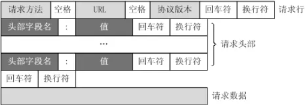
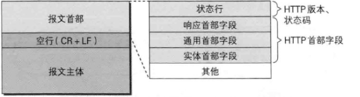
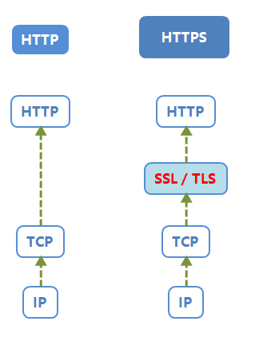
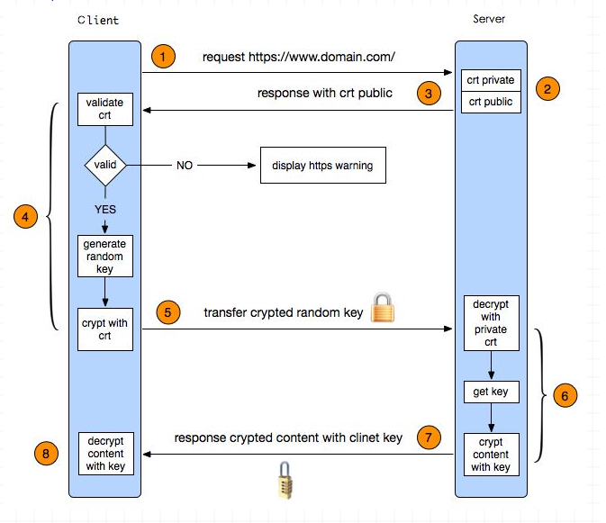
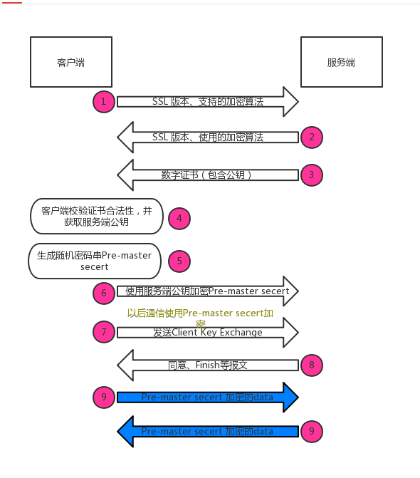

# HTTP与HTTPS

## HTTP

HTTP是一种超文本传输协议，HTTP是缩写，它的全英文名是`HyperText Transfer Protocol`

超文本指的是HTML，CSS，JavaScript和图片等，HTTP的出现是为了接收和发布HTML页面，经过不断的发展也可以用于接收一些音频，视频，文件等内容。

**HTTP协议是用于客户端和服务器端之间的通信**，用于客户端和服务器端之间的通信有HTTP协议和TCP/IP协议族在内的其他众多的协议。

**请求访问文本或图片等资源的一方**，我们叫做客户端；负责接收，**提供响应的一方**称为服务器端。

**Client客户端请求Server服务端，Server服务端响应给Client客户端。**HTTP是基于客户端/服务端的架构模型，浏览器或其他任何客户端都可以用HTTP协议的，通过URL地址向HTTP的服务器即Web服务器发送所有请求，Web服务器端在接收到请求后会做出反应，响应给对方，就是向客户端回传响应的信息

### URL

URL格式：`[scheme:][//host:port][path][?query][#fragment]`

例如：`http://www.xxxxxx.cn:80/mix/1.html?name=test&password=123456#first`

#### 1.协议部分

该`URL`的协议部分为`http:`，表示网页用的是`HTTP`协议，后面的`//`为分隔符

#### 2.域名部分

域名是`www.xxxxxx.cn`，发送请求时，需要向`DNS`服务器解析`IP`。如果为了优化请求，可以直接用`IP`作为域名部分使用

#### 3.端口部分

域名后面的`80`表示端口，和域名之间用`:`分隔，端口不是一个`URL`的必须的部分。如果端口是`80`，也可以省略不写

#### 4.虚拟目录部分

从域名的第一个`/`开始到最后一个`/`为止，是虚拟目录的部分。其中，虚拟目录也不是`URL`必须的部分，本例中的虚拟目录是`/mix/`

#### 5.文件名部分

从域名最后一个`/`开始到`?`为止，是文件名部分；如果没有`?`，则是从域名最后一个`/`开始到`#`为止，是文件名部分；如果没有`?`和`#`，那么就从域名的最后一个`/`从开始到结束，都是文件名部分。本例中的文件名是`1.html`，文件名也不是一个`URL`的必须部分，如果没有文件名，则使用默认文件名

#### 6.锚部分

从`#`开始到最后，都是锚部分。本部分的锚部分是`first`，锚也不是一个`URL`必须的部分

#### 7.参数部分

从`?`开始到`#`为止之间的部分是参数部分，又称为搜索部分、查询部分。本例中的参数是`name=test&password=123456`，如果有多个参数，各个参数之间用`&`作为分隔符。


### HTTP的请求



包括：请求行(request line)、请求头部(header)、空行 和 请求数据 四个部分组成

```
{method} {path} {http_version}(CRLF)
{header_name}: {header_value}(CRLF)
...more header info(CRLF)
(CRLF)
{content}
```


#### 1.请求行

请求行由请求方法字段、URL字段和HTTP协议版本字段3个字段组成，它们用空格分隔。例如，GET /index.html HTTP/1.1。

HTTP协议的请求方法有`GET、POST、HEAD、PUT、DELETE、OPTIONS、TRACE、CONNECT`

而常见的有如下几种：

**1)  GET**

最常见的一种请求方式，当客户端要从服务器中读取文档时，当点击网页上的链接或者通过在浏览器的地址栏输入网址来浏览网页的，使用的都是GET方式。GET方法要求服务器将URL定位的资源放在响应报文的数据部分，回送给客户端。使用GET方法时，请求参数和对应的值附加在URL后面，利用一个问号（“?”）代表URL的结尾与请求参数的开始，传递参数长度受限制。例如，/index.jsp?id=100&op=bind,这样通过GET方式传递的数据直接表示在地址中，所以我们可以把请求结果以链接的形式发送给好友。以用google搜索domety为例，Request格式如下：

[](javascript:void(0);)

```html
GET /search?hl=zh-CN&source=hp&q=domety&aq=f&oq= HTTP/1.1  
Accept: image/gif, image/x-xbitmap, image/jpeg, image/pjpeg, application/vnd.ms-excel, application/vnd.ms-powerpoint, application/msword, application/x-silverlight, application/x-shockwave-flash, */*  
Referer: <a href="http://www.google.cn/">http://www.google.cn/</a>  
Accept-Language: zh-cn  
Accept-Encoding: gzip, deflate  
User-Agent: Mozilla/4.0 (compatible; MSIE 6.0; Windows NT 5.1; SV1; .NET CLR 2.0.50727; TheWorld)  
Host: <a href="http://www.google.cn">www.google.cn</a>  
Connection: Keep-Alive  
Cookie: PREF=ID=80a06da87be9ae3c:U=f7167333e2c3b714:NW=1:TM=1261551909:LM=1261551917:S=ybYcq2wpfefs4V9g; NID=31=ojj8d-IygaEtSxLgaJmqSjVhCspkviJrB6omjamNrSm8lZhKy_yMfO2M4QMRKcH1g0iQv9u-2hfBW7bUFwVh7pGaRUb0RnHcJU37y-FxlRugatx63JLv7CWMD6UB_O_r  
```

[](javascript:void(0);)

可以看到，GET方式的请求一般不包含”请求内容”部分，请求数据以地址的形式表现在请求行。地址链接如下：

```html
<a href="http://www.google.cn/search?hl=zh-CN&source=hp&q=domety&aq=f&oq=">http://www.google.cn/search?hl=zh-CN&source=hp
&q=domety&aq=f&oq=</a> 
```

地址中”?”之后的部分就是通过GET发送的请求数据，我们可以在地址栏中清楚的看到，各个数据之间用”&”符号隔开。显然，这种方式不适合传送私密数据。另外，由于不同的浏览器对地址的字符限制也有所不同，一般最多只能识别1024个字符，所以如果需要传送大量数据的时候，也不适合使用GET方式。

 

**2)  POST**

对于上面提到的不适合使用GET方式的情况，可以考虑使用POST方式，因为使用POST方法可以允许客户端给服务器提供信息较多。POST方法将请求参数封装在HTTP请求数据中，以名称/值的形式出现，可以传输大量数据，这样POST方式对传送的数据大小没有限制，而且也不会显示在URL中。还以上面的搜索domety为例，如果使用POST方式的话，格式如下：

[](javascript:void(0);)

```
POST /search HTTP/1.1  
Accept: image/gif, image/x-xbitmap, image/jpeg, image/pjpeg, application/vnd.ms-excel, application/vnd.ms-powerpoint, application/msword, application/x-silverlight, application/x-shockwave-flash, */*  
Referer: <a href="http://www.google.cn/">http://www.google.cn/</a>  
Accept-Language: zh-cn  
Accept-Encoding: gzip, deflate  
User-Agent: Mozilla/4.0 (compatible; MSIE 6.0; Windows NT 5.1; SV1; .NET CLR 2.0.50727; TheWorld)  
Host: <a href="http://www.google.cn">www.google.cn</a>  
Connection: Keep-Alive  
Cookie: PREF=ID=80a06da87be9ae3c:U=f7167333e2c3b714:NW=1:TM=1261551909:LM=1261551917:S=ybYcq2wpfefs4V9g; NID=31=ojj8d-IygaEtSxLgaJmqSjVhCspkviJrB6omjamNrSm8lZhKy_yMfO2M4QMRKcH1g0iQv9u-2hfBW7bUFwVh7pGaRUb0RnHcJU37y-FxlRugatx63JLv7CWMD6UB_O_r  

hl=zh-CN&source=hp&q=domety  
```

[](javascript:void(0);)

可以看到，POST方式请求行中不包含数据字符串，这些数据保存在”请求内容”部分，各数据之间也是使用”&”符号隔开。POST方式大多用于页面的表单中。因为POST也能完成GET的功能，因此多数人在设计表单的时候一律都使用POST方式，其实这是一个误区。GET方式也有自己的特点和优势，我们应该根据不同的情况来选择是使用GET还是使用POST。

**3)  HEAD**

HEAD就像GET，只不过服务端接受到HEAD请求后只返回响应头，而不会发送响应内容。当我们只需要查看某个页面的状态的时候，使用HEAD是非常高效的，因为在传输的过程中省去了页面内容。


#### 2.请求头部

请求头部由关键字/值对组成，每行一对，关键字和值用英文冒号“:”分隔。请求头部通知服务器有关于客户端请求的信息，典型的请求头有：

User-Agent：产生请求的浏览器类型。

Accept：客户端可识别的内容类型列表。

Host：请求的主机名，允许多个域名同处一个IP地址，即虚拟主机。

 

#### 3.空行

最后一个请求头之后是一个空行，发送回车符和换行符，通知服务器以下不再有请求头。

 

#### 4.请求数据

请求数据不在GET方法中使用，而是在POST方法中使用。POST方法适用于需要客户填写表单的场合。与请求数据相关的最常使用的请求头是Content-Type和Content-Length。

```html
首部字段例子：

Accept: text/html,image/*    【浏览器告诉服务器，它支持的数据类型】

Accept-Charset: ISO-8859-1    【浏览器告诉服务器，它支持哪种字符集】

Accept-Encoding: gzip,compress 【浏览器告诉服务器，它支持的压缩格式】

Accept-Language: en-us,zh-cn 【浏览器告诉服务器，它的语言环境】

Host: www.it315.org:80【浏览器告诉服务器，它的想访问哪台主机】

If-Modified-Since: Tue, 11 Jul 2000 18:23:51 GMT【浏览器告诉服务器，缓存数据的时间】

Referer: http://www.it315.org/index.jsp【浏览器告诉服务器，客户机是从那个页面来的---反盗链】

8.User-Agent: Mozilla/4.0 (compatible; MSIE 5.5; Windows NT 5.0)【浏览器告诉服务器，浏览器的内核是什么】

Cookie【浏览器告诉服务器，带来的Cookie是什么】

Connection: close/Keep-Alive  【浏览器告诉服务器，请求完后是断开链接还是保持链接】

Date: Tue, 11 Jul 2000 18:23:51 GMT【浏览器告诉服务器，请求的时间】
```


### HTTP响应报文

HTTP响应报文：在响应中，HTTP报文由HTTP版本、状态码（数字和原因短语）、HTTP首部字段3部分组成。



1. 一个状态行【用于描述**服务器对请求的处理结果。**】
2. 首部字段【用于描述**服务器的基本信息**，以及**数据的描述**，**服务器通过这些数据的描述信息，可以通知客户端如何处理等一会儿它回送的数据**】
3. 一个空行
4. 实体内容【**服务器向客户端回送的数据**】

```
Location: http://www.it315.org/index.jsp 【服务器告诉浏览器要跳转到哪个页面】

Server:apache tomcat【服务器告诉浏览器，服务器的型号是什么】

Content-Encoding: gzip 【服务器告诉浏览器数据压缩的格式】

Content-Length: 80 【服务器告诉浏览器回送数据的长度】

Content-Language: zh-cn 【服务器告诉浏览器，服务器的语言环境】

Content-Type: text/html; charset=GB2312 【服务器告诉浏览器，回送数据的类型】

Last-Modified: Tue, 11 Jul 2000 18:23:51 GMT【服务器告诉浏览器该资源上次更新时间】

Refresh: 1;url=http://www.it315.org【服务器告诉浏览器要定时刷新】

Content-Disposition: attachment; filename=aaa.zip【服务器告诉浏览器以下载方式打开数据】

Transfer-Encoding: chunked  【服务器告诉浏览器数据以分块方式回送】

Set-Cookie:SS=Q0=5Lb_nQ; path=/search【服务器告诉浏览器要保存Cookie】

Expires: -1【服务器告诉浏览器不要设置缓存】

Cache-Control: no-cache  【服务器告诉浏览器不要设置缓存】

Pragma: no-cache   【服务器告诉浏览器不要设置缓存】

Connection: close/Keep-Alive   【服务器告诉浏览器连接方式】

Date: Tue, 11 Jul 2000 18:23:51 GMT【服务器告诉浏览器回送数据的时间】
```


常见的首部：

- **通用首部字段（请求报文与响应报文都会使用的首部字段）**

- - Date：创建报文时间
  - Connection：连接的管理
  - Cache-Control：缓存的控制
  - Transfer-Encoding：报文主体的传输编码方式

- **请求首部字段（请求报文会使用的首部字段）**

- - Host：请求资源所在服务器
  - Accept：可处理的媒体类型
  - Accept-Charset：可接收的字符集
  - Accept-Encoding：可接受的内容编码
  - Accept-Language：可接受的自然语言

- **响应首部字段（响应报文会使用的首部字段）**

- - Accept-Ranges：可接受的字节范围
  - Location：令客户端重新定向到的URI
  - Server：HTTP服务器的安装信息

- **实体首部字段（请求报文与响应报文的的实体部分使用的首部字段）**

- - Allow：资源可支持的HTTP方法
  - Content-Type：实体主类的类型
  - Content-Encoding：实体主体适用的编码方式
  - Content-Language：实体主体的自然语言
  - Content-Length：实体主体的的字节数
  - Content-Range：实体主体的位置范围，一般用于发出部分请求时使用

## HTTPS简介

`HTTPS`是安全的`HTTP`通道，即在HTTP通信中加入了`SSL`层（当前版本是`TLS1.2`），通信的数据被加密了，防止被窃取，具体的通信流程如下

HTTP在安全上是不足的

- 通信使用明文【没有加密过内容的】
- 不验证通信方身份，无论是客户端和服务器，都是随意通信的
- 无法证明报文的完整性【别人监听后，可以篡改】



> Http与Https的区别：

1. HTTP 的URL 以http:// 开头，而HTTPS 的URL 以https:// 开头
2. HTTP 是不安全的，而 HTTPS 是安全的
3. HTTP 标准端口是80 ，而 HTTPS 的标准端口是443
4. 在OSI 网络模型中，HTTP工作于应用层，而SSL（安全套接字）与TLS（运输层安全）都属于运输层协议
5. HTTP 无法加密，而HTTPS 对传输的数据进行加密
6. HTTP无需证书，而HTTPS 需要CA机构的颁发的SSL证书

HTTP 页面响应速度比HTTPS 快，主要是因为HTTP 使用TCP 三次握手建立连接，客户端和服务器需要交换3 个包，而HTTPS除了TCP 的三个包，还要加上ssl 握手需要的9 个包，所以一共是12 个包

### HTTPS工作原理


- 一、首先HTTP请求服务端生成证书，客户端对证书的有效期、合法性、域名是否与请求的域名一致、证书的公钥（RSA加密）等进行校验；
- 二、客户端如果校验通过后，就根据证书的公钥的有效， 生成随机数，随机数使用公钥进行加密（RSA加密）；
- 三、消息体产生的后，对它的摘要进行MD5（或者SHA1）算法加密，此时就得到了RSA签名；
- 四、发送给服务端，此时只有服务端（RSA私钥）能解密。
- 五、解密得到的随机数，再用AES加密，作为密钥（此时的密钥只有客户端和服务端知道）






https://www.jianshu.com/p/7158568e4867

## 一次完整的HTTP请求所经历的7个步骤

> 一次完整的HTTP请求所经历的7个步骤

HTTP通信机制是在一次完整的HTTP通信过程中，Web浏览器与Web服务器之间将完成下列7个步骤：

- 建立TCP连接

在HTTP工作开始之前，Web浏览器首先要通过网络与Web服务器建立连接，该连接是通过TCP来完成的，该协议与IP协议共同构建 Internet，即著名的TCP/IP协议族，因此Internet又被称作是TCP/IP网络。**HTTP是比TCP更高层次的应用层协议，根据规则， 只有低层协议建立之后才能，才能进行更层协议的连接，因此，首先要建立TCP连接，一般TCP连接的端口号是80。**

- Web浏览器向Web服务器发送请求行

一旦建立了TCP连接，**Web浏览器就会向Web服务器发送请求命令**。例如：GET /sample/hello.jsp HTTP/1.1。

- Web浏览器发送请求头

- - 浏览器发送其请求命令之后，还要以头信息的形式向Web服务器发送一些别的信息，**之后浏览器发送了一空白行来通知服务器**，它已经结束了该头信息的发送。

- Web服务器应答

- - 客户机向服务器发出请求后，服务器会客户机回送应答， **HTTP/1.1 200 OK ，应答的第一部分是协议的版本号和应答状态码。**

- Web服务器发送应答头

- - 正如客户端会随同请求发送关于自身的信息一样，服务器也会随同应答向用户发送关于它自己的数据及被请求的文档。

- Web服务器向浏览器发送数据

- - Web服务器向浏览器发送头信息后，它会发送一个空白行来表示头信息的发送到此为结束，接着，**它就以Content-Type应答头信息所描述的格式发送用户所请求的实际数据**。

- Web服务器关闭TCP连接

  `Connection:keep-alive`

- - 一般情况下，一旦Web服务器向浏览器发送了请求数据，它就要关闭TCP连接，然后如果浏览器或者服务器在其头信息加入了这行代码：

TCP连接在发送后将仍然保持打开状态，于是，浏览器可以继续通过相同的连接发送请求。保持连接节省了为每个请求建立新连接所需的时间，还节约了网络带宽。

建立TCP连接->发送请求行->发送请求头->（到达服务器）发送状态行->发送响应头->发送响应数据->断TCP连接

最具体的HTTP请求过程：http://blog.51cto.com/linux5588/1351007


## HTTP优化方案

我下面就简要概括一下：

- **TCP复用：TCP连接复用是将多个客户端的HTTP请求复用到一个服务器端TCP连接上，而HTTP复用则是一个客户端的多个HTTP请求通过一个TCP连接进行处理。前者是负载均衡设备的独特功能；而后者是HTTP 1.1协议所支持的新功能，目前被大多数浏览器所支持。**
- **内容缓存：将经常用到的内容进行缓存起来，那么客户端就可以直接在内存中获取相应的数据了。**
- **压缩：将文本数据进行压缩，减少带宽**
- **SSL加速（SSL Acceleration）：使用SSL协议对HTTP协议进行加密，在通道内加密并加速**
- **TCP缓冲：通过采用TCP缓冲技术，可以提高服务器端响应时间和处理效率，减少由于通信链路问题给服务器造成的连接负担。**

参考链接：

https://www.jianshu.com/p/8fe93a14754c

https://www.cnblogs.com/biyeymyhjob/archive/2012/07/28/2612910.html

https://mp.weixin.qq.com/s?__biz=MzI4Njg5MDA5NA==&mid=2247484979&idx=2&sn=abe78c7ce58c15cb8b2e26602802e096&chksm=ebd74732dca0ce24b00b10ed3948801bc1ab0fdfa3cdb478b21d1048a4e5564bbda2316b31bb###rd	