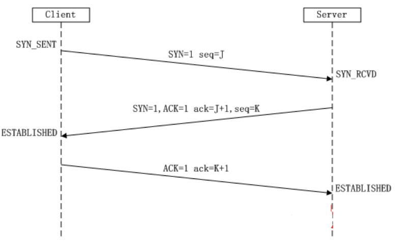
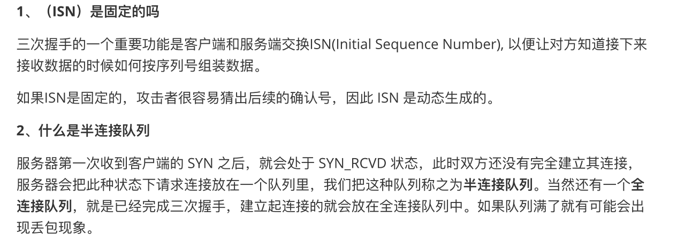
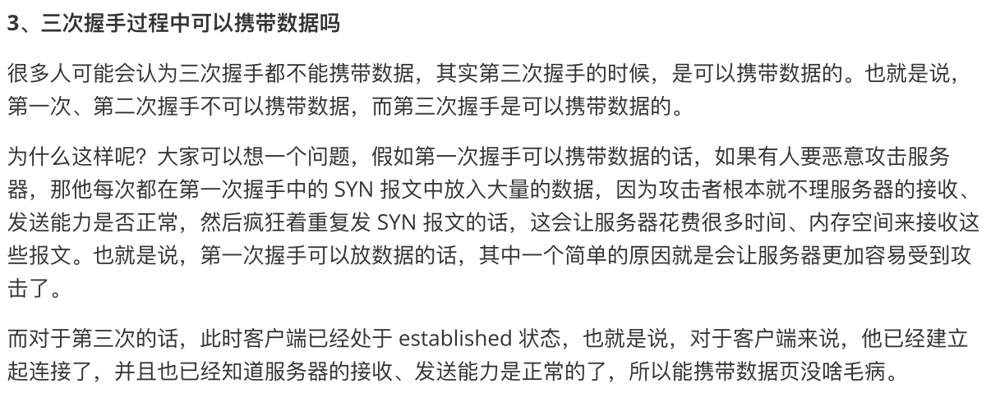
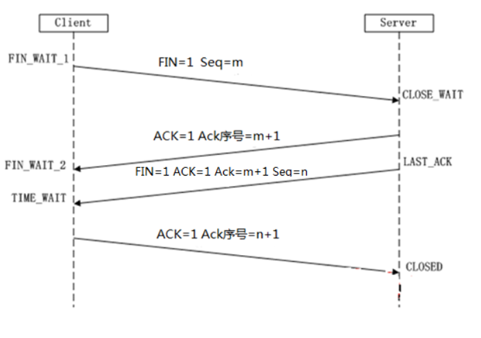

# TCP三次握手

[wireshark抓包读懂tcp三次握手](https://juejin.im/post/5cdbdd3bf265da03b57b7cf1)

[wireshark学习TCP三次握手](https://www.cnblogs.com/tankxiao/archive/2012/10/10/2711777.html)

[TCP协议灵魂之问，巩固你的网路底层基础](https://network.51cto.com/art/202003/613062.htm)

[近40张图解被问千百遍的TCP三次握手和四次挥手面试题](https://network.51cto.com/art/202004/614026.htm)

## TCP协议数据格式

## TCP包头作用

#### 序号：

Seq序号，占32位，用来标识从TCP源端向目的端发送的字节流，发起方发送数据时对此进行标记。

#### 确认号：

Ack序号，占32位，只有ACK标志位为1时，确认序号字段才有效，Ack=Seq+1。

#### 标志位：共6个

即URG、ACK、PSH、RST、SYN、FIN等，具体含义如下：

- URG：紧急指针（urgent pointer）有效。
- ACK：确认序号有效。
- PSH：接收方应该尽快将这个报文交给应用层。
- RST：重置连接。
- SYN：发起一个新连接。
- FIN：释放一个连接。

## 三次握手过程

1、第⼀次握手：客户端给服务器发送一个  SYN 报文。
2、第二次握手：服务器器收到  SYN 报⽂文之后，会应答一个  SYN+ACK 报文。
3、第三次握手：客户端收到  SYN+ACK 报⽂文之后，会回应一个  ACK 报文。
4、服务器收到  ACK 报文之后，三次握手建立完成。

==作用是为了确认双方的接收与发送能力是否正常。==

这里我顺便解释一下为啥只有三次握手才能确认双方的接受与发送能力是否正常，而两次却不可
以： 

第一次握手：客户端发送网络包，服务端收到了。这样服务端就能得出结论：客户端的发送能力、服务端的接收能力是正常的。

第二次握手：服务端发包，客户端收到了。这样客户端就能得出结论：服务端的接收、发送能力，客户端的接收、发送能力是正常的。不过此时服务器器并不能确认客户端的接收能力是否正常。 

第三次握手：客户端发包，服务端收到了。这样服务端就能得出结论：客户端的接收、发送能力正常，服务器器自己的发送、接收能力也正常。

因此，需要三次握手才能确认双方的接收与发送能力是否正常。

第一次握手：Client将标志位SYN置为1，随机产生一个值seq=J，并将该数据包发送给Server，Client进入SYN_SENT状态，等待Server确认。

第二次握手：Server收到数据包后由标志位SYN=1知道Client请求建立连接，Server将标志位SYN和ACK都置为1，ack 序号J+1，随机产生一个值seq=K，并将该数据包发送给Client以确认连接请求，Server进入SYN_RCVD状态。

第三次握手：Client收到确认后，检查ack序号是否为J+1，标志位ACK是否为1，如果正确则将标志位ACK置为1，ack序号=K+1，并将该数据包发送给Server；Server检查ack序号是否为K+1，ACK是否为1，如果正确则连接建立成功，Client和Server进入ESTABLISHED状态，完成三次握手，随后Client与Server之间可以开始传输数据了。

## 三次握手的作用

1、确认双方的接受能力、发送能力是否正常。
2、指定自己的初始化序列号，为后面的可靠传送做准备。

> 这里在补充一点关于 SYN-ACK 重传次数的问题：　
>
> 服务器发送完 SYN－ACK包，如果未收到客户确认包，服务器进行首次重传，等待一段时间仍未收到客户确认包，进行第二次重传，如果重传次数超过系统规定的最大重传次数，系统将该连接信息从半连接队列中删除。
>
> 注意，每次重传等待的时间不一定相同，一般会是指数增长，例如间隔时间为  1s, 2s, 4s, 8s, ....

# TCP四次挥手

刚开始双方都处于 ` establised` 状态，假如是客户端先发起关闭请求，则：

第一次挥手：Client发送一个标志位为FIN包，Seq序号=m，用来关闭Client到Server的数据传送，Client进入FIN_WAIT_1状态。

第二次挥手：Server收到标志位FIN包后，发送一个标志位ACK给Client，Ack确认序号为m+1，Server进入CLOSE_WAIT状态。

第三次挥手：Server发送一个标志位FIN=1,ACK=1，Seq序号=n，Ack确认号=m+1，用来关闭Server到Client的数据传送，Server进入LAST_ACK状态。

第四次挥手：Client收到FIN后，Client进入TIME_WAIT状态，==需要过⼀阵子以确保服务端收到自
己的  ACK 报文之后才会进入  CLOSED 状态== 接着发送一个ACK标志给Server，Ack确认序号=n+1，Server进入CLOSED状态，完成四次挥手。

### TIME_WAIT

这个是面试的高频考点，就是要理解，为什么客户端发送 ACK 之后不直接关闭，而是要等一阵子才关闭。这其中的原因就是，要确保服务器是否已经收到了我们的 ACK 报文，如果没有收到的话，服务器会重新发  FIN 报文给客户端，客户端再次收到  ACK 报文之后，就知道之前的 ACK 报文丢失了，然后再次发送  ACK 报文。

至于  TIME_WAIT 持续的时间⾄至少是一个报文的来回时间。一般会设置一个计时，如果过了这个计时没有再次收到 FIN 报文，则代表对方成功接收  ACK 报文，此时处于  CLOSED 状态。

